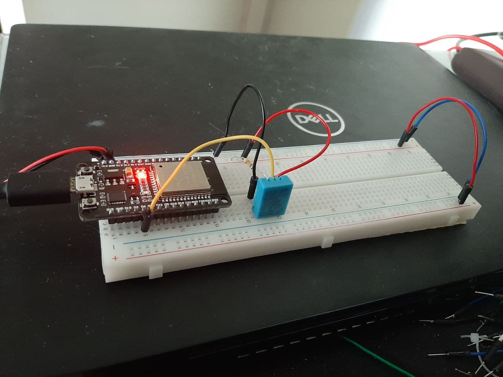

# Projeto Final - 2020/2

#### Aluno: Eduardo Vieira Lima
#### Matrícula: 17/0102343

## Pré-requisitos
- [ESP-IDF](https://docs.espressif.com/projects/esp-idf/en/latest/esp32/get-started/index.html)
- Python (3.8 ou superior)
- Python curses
- paho-mqtt ```pip install paho-mqtt```

## Instrucões de uso
### ESP32
- Após configurar a pasta esp32 com o export_sh da ESP_IDF, execute ```idf.py menuconfig``` para configurar suas preferências
- No menu "Configuração do Wifi" é possível inserir o SSID e senha de sua wifi para a conexão da esp32
- No menu "Configuração do Projeto" é possível alterar a matricula padrão e selecionar o modo de operação da esp32(bateria ou energia)
- Após buildar o projeto com ```idf.py build```, basta executar ```idf.py -p <porta_usb_esp> flash monitor``` para inciar e monitorar a execução da esp

### Central
- Para iniciar, execute ```python3 server.py``` na pasta central e insira a matricula desejada



## Importante

- É necessário executar primeiro o servidor central e então o distribuído.
- Para desligar o servidor distribuído basta enviar um sinal (ou CTRL + C no terminal);
- Os endereços de IP configurados no projeto mudaram durante testes, talvez seja necessário validá-los em caso de erro